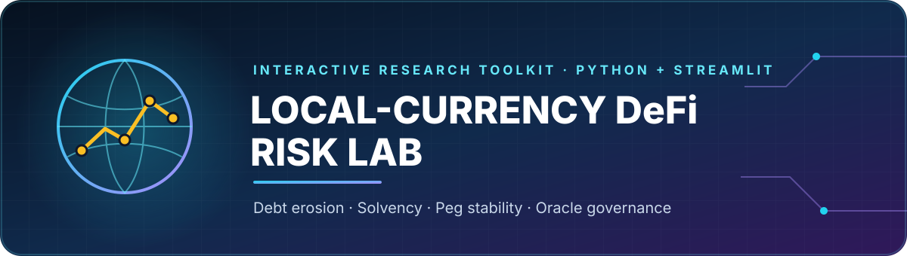
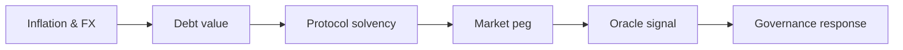

<p align="center">
  
</p>

<p align="center">
  A transparent, interactive companion implementation for research on local-currency lending, stablecoin markets, protocol solvency, and automated risk control.
</p>

<p align="center">
  
  
  
  
  
</p>

## Why This Project

Local-currency DeFi does not have a single risk surface. Inflation can reduce the hard-currency value of debt, but the same currency shock can destabilise collateral ratios, impair secondary-market liquidity, delay oracle signals, and force governance to change protocol parameters.

**Local-Currency DeFi Risk Lab** links those layers in one reproducible interface. It turns four connected research questions into models that can be inspected, changed, plotted, and exported without hiding assumptions behind a proprietary engine.

## The Four Modules

| Module | Research question | Main outputs |
|---|---|---|
| **Debt Erosion** | When does FX depreciation outpace local borrowing costs? | USD debt, asset value, borrower equity, ROI |
| **Solvency Stress** | How do collateral and currency shocks affect protocol health? | Liquidation probability, insolvency probability, expected bad debt |
| **Peg Stability** | What limits arbitrage-driven recovery after a peg shock? | Recovery path, time to ±1%, arbitrage deployment |
| **Oracle & Governance** | How much risk accumulates before delayed governance reacts? | Oracle error, unprotected exposure, debt ceiling, risk score |

## Model Flow



## Features

- Four interactive Streamlit pages with shared dark research UI
- Transparent Python model layer independent from the interface
- Deterministic scenario analysis and correlated Monte Carlo stress tests
- Interactive Plotly charts and downloadable CSV results
- Editable illustrative country starting scenarios
- Unit tests for model behaviour, validation, and reproducibility
- GitHub Actions workflow for continuous testing
- Citation metadata for research reuse

## Quick Start

```bash
git clone https://github.com/nikorokni/local-currency-defi-risk-lab.git
cd local-currency-defi-risk-lab
python -m venv .venv
source .venv/bin/activate        # Windows: .venv\Scripts\activate
pip install -r requirements.txt
streamlit run app.py
```

The application opens at [http://localhost:8501](http://localhost:8501).

## Project Structure

```text
.
├── app.py                         # Landing page
├── pages/                         # Four interactive research modules
├── risk_lab/                      # Tested simulation model package
│   ├── debt_erosion.py
│   ├── solvency.py
│   ├── peg.py
│   ├── governance.py
│   └── ui.py
├── data/                          # Illustrative scenario inputs
├── tests/                         # Model unit tests
├── .streamlit/config.toml         # Dark interface theme
├── .github/workflows/tests.yml    # Continuous integration
└── CITATION.cff
```

## Core Assumptions

The models are deliberately reduced-form and interpretable:

- FX is quoted as local-currency units per USD.
- Debt and asset growth use annual compound rates.
- Solvency paths use correlated lognormal collateral and FX shocks.
- Peg recovery is an exponential convergence process controlled by capital depth, fees, and delay.
- Governance gradually updates debt ceilings and liquidation ratios in response to reported drawdowns.

These assumptions make the lab useful for scenario comparison and robustness analysis, but not for live trading, protocol execution, or forecasting.

## Run the Tests

```bash
pip install -r requirements-dev.txt
pytest -q
```

## Data Policy

The included country scenarios are illustrative and clearly labelled. Empirical studies should replace them with dated, cited observations and preserve the exact FX convention, market type, frequency, and transformation history. See [`data/README.md`](data/README.md).

## Research Context

The lab connects a four-paper research sequence covering:

1. inflation-driven local-currency debt erosion;
2. protocol solvency under joint macro-financial stress;
3. stablecoin liquidity, arbitrage, and peg resilience; and
4. oracle latency, adaptive governance, and automated risk engines.

## Limitations

- The simulations are not calibrated forecasts.
- No live oracle, wallet, private key, or proprietary API is used.
- AMM behaviour is represented in reduced form rather than as a specific pool invariant.
- Regulatory, legal, and operational risks remain outside the current model scope.

## Citation

Use the repository's [`CITATION.cff`](CITATION.cff) metadata and cite the relevant companion paper when using a specific module in academic work.

## Author

**Niko Rokni Lamouki**<br>
Big Data Technologies · DeFi Research · Blockchain & AI<br>
[GitHub](https://github.com/nikorokni)

---

<p align="center"><strong>Research software — not financial advice.</strong></p>
